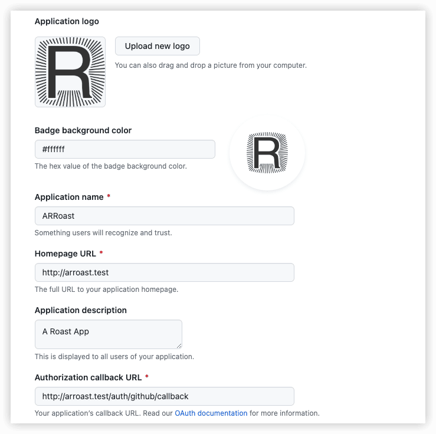

ARRoastapp
---

https://laravelacademy.org/books/api-driven-development-laravel-vue

Laravel 10 + Vue 3

## 一 Laravel初始化

### 1 初始化Laravel单页面应用

主要功能是查找本地附近的咖啡烘培店和专卖店


```sh
composer create-project --prefer-dist laravel/laravel ARRoastapp "10.*"
```

#### 清理默认安装配置

- 移除 `app/Http/Controllers/Auth` 目录，将通过 Socialite 重构用户认证功能
- 移除 `resources/views/welcome.blade.php` 文件，这个是默认的欢迎页面，不需要它

#### 新增目录

对于提供 API 的应用而言，我们可以基于 API 和 Web 将控制器进行分隔：

- 创建 `app/Http/Controllers/API` 目录来存放 API 控制器
- 创建 `app/Http/Controllers/Web` 目录来存放 Web 控制器

如果以后还会开发其它应用，比如博客、电商、社交等，也可以这么做。

#### 新增视图

单页面应用（SPA）🔖在整个应用中只需要两个视图即可！一个可以展示SPA视图以及一个登录视图：

- 新增 `resources/views/app.blade.php` 视图文件
- 新增 `resources/views/login.blade.php` 视图文件

🔖 

在两个地方存放了 CSRF Token 值，一个是名为 `csrf-token` 的 meta 标签，一个是全局 JavaScript 变量 `window.Laravel`，我们会将其添加到 Axios 请求头，以便在每个请求中传递来阻止恶意请求。此外，我们还需要在所有 API 路由和 Web 路由的 `CreateFreshApiToken` 中使用 `auth:api` 中间件（下一篇教程中详细讲述），以便可以安全消费应用自己提供的 API。

`<div id="app"><router-view></router-view></div> `元素将在我们开发应用侧边栏时包含由 VueRouter 定义的路由视图。

#### 新增 Web 控制器和路由

```php
<?php

namespace app\Http\Controllers\Web;

use App\Http\Controllers\Controller;

class AppController extends Controller
{
    public function getApp()
    {
        return view('app');
    }
}
```


```php
Route::get('/', [AppController::class, 'getApp'])->middleware('auth');
```


本应用只允许认证用户才能访问，所以在入口路由上使用了 `auth` 中间件。

### 2 安装配置Laravel Socialite并实现基于Github的用户认证


```sh
composer require laravel/socialite
```


#### 配置 Github 认证

https://github.com/settings/developers



```
http://arroast.test/auth/github/callback
```


将新增应用的 Client ID、Client Secret 及授权回调 URL 信息添加到应用根目录下 `.env` 配置文件中。

```
GIT_CLIENT_ID=你的 Github 应用 Client ID
GIT_CLIENT_SECRET=你的 Github 应用 Client Secret
GIT_REDIRECT=你的 Github 应用授权回调URL
```

在 `config/services.php` 配置文件中新增配置：

```json
    'github' => [
        'client_id' => env('GIT_CLIENT_ID'),
        'client_secret' => env('GIT_CLIENT_SECRET'),
        'redirect' => env('GIT_REDIRECT')
    ]
```


> 上面就完成了基于 Github 登录所需的所有配置信息配置工作，其它第三方 OAuth 登录操作步骤也是与此类似。

#### 实现基于Github进行登录认证

1. 创建控制器 `/app/Http/Controllers/Web/AuthenticationController.php`

2. 在 `routes/web.php` 中注册登录路由：

```php
// 登录页面
// guest中间件的用途是登录用户访问该路由会跳转到指定认证后页面，而非登录用户访问才会显示登录页面。
Route::get("/login", [AppController::class, 'getLogin'])->name('login')->middleware('guest'); 
```

3. 修改RedirectIfAuthenticated中的重定向,`redirect('/');`

4. 定义AppController的getLogin方法

现在访问 `http://roast.test`，就会跳转到登录页面了。现在页面上只显示了一个简陋的登录链接。

5. 注册登录认证路由

```php
// 注册登录认证路由
// {social}代表所使用的OAuth提供方，比如github，Socialite会根据这个参数值去config/services.php中获取对应的OAuth配置信息。
Route::get('/auth/{social}', [AuthenticationController::class, 'getSocialRedirect'])->middleware('guest');
Route::get('/auth/{social}/callback', [AuthenticationController::class, 'getSocialCallback'])->middleware('guest');
```

6. 在AuthenticationController.php中编写具体的GitHub登录认证代码


7. 修改并运行数据库（用户表）迁移文件，添加字段：

```php
$table->string('provider')->comment('OAuth服务提供方，如github');
$table->string('provider_id')->comment('从第三方OAuth那里获取的用户唯一ID');
$table->text('avatar')->comment('从第三方OAuth获取的用户头像');
```

删除迁移文件 `CreatePasswordResetsTable` ，在本应用中用不到它。🔖

```
php artisan migrate
```


### 3 安装配置Laravel Passport

通过 [Laravel Passport](https://github.com/laravel/passport)，你可以在几分钟内搭建起一个功能完备的 OAuth 服务器，用户可以像 Github、微信、QQ、Google 那样基于你提供的 OAuth 服务登录到不同的 Web 服务。不过，我们的目标是**不同设备通过同一个入口获取同一份数据**，而这正是 API 驱动应用的强大之处。对所有数据库增删改查方法而言，数据结构和调用方法都是一样的，你可以从多个平台消费这些 API，例如移动端、Web 浏览器。


Laravel Socialite，以便用户通过社交媒体账户提供的 OAuth 服务进行登录认证。

而Laravel Passport 搭建一个自己的 OAuth 服务器，以便颁发凭证给用户，让他们可以访问自己的应用数据，比如授权登录。


```sh
composer require laravel/passport
```

#### 1️⃣安装Passport并进行数据库迁移

```sh
php artisan passport:install
```


生成安全访问令牌（token）所需的加密键，此外，该命令还会创建「personal access」和「password grant」客户端用于生成访问令牌，保存在表`oauth_clients`中。

#### 2️⃣在用户模型类中使用 HasApiTokens


#### 3️⃣在AuthServiceProvider中注册 Passport 路由

🔖

#### 4️⃣设置Passport在输入API请求中使用

做好以上初始化及配置工作后，还需要将 API 认证驱动设置为 Laravel Passport，这既能在用户通过 Session 登录访问 API 时派上用场，也能检查移动端请求头中的访问令牌。

 `config/auth.php`

```json
    'api' => [
        'driver' => 'passport',
        'provider' => 'users',
    ]
```


#### 5️⃣从 Web 浏览器访问认证 API


#### 6️⃣清理 routes/api.php 文件


## 二 JavaScript初始化

### 4 配置JavaScript和SASS

[mix到vite的迁移指南](https://github.com/laravel/vite-plugin/blob/main/UPGRADE.md#migrating-from-laravel-mix-to-vite) 


```sh
npm install foundation-sites --save-dev
```


### 5 引入Vue3、Vue Router和Vuex

Vuex 用于处理单页面应用数据的状态管理系统，它会在单一数据源（Single Source of Truth）中存放应用所使用的所有数据，这在处理大型应用程序的时候非常有用。如果你之前使用过组件和模块但没有使用过单一数据源，就需要来回传递很多属性来保持数据的同步，随着应用越来越复杂，这样的操作会越来越麻烦，使应用变得难以维护。而使用 Vuex 的话，你可以导入特定模块到组件中，这样这些组件就可以访问模块中的数据，你可以调用执行变更的动作来更新数据，以保证所有更改都被跟踪，所有数据都保持同步。更多细节请阅读 [Vuex 文档](https://vuex.vuejs.org/zh/)。


```sh
npm install vue-router --save-dev

npm install vuex --save-dev
```


#### 配置JavaScript目录

好的目录结构可以让项目更容易维护，也具备更好的可读性。

- 创建 `resources/assets/js/api` 目录，用于存放前端 API 路由调用
- 创建 `resources/assets/js/components` 目录，用于存放 Vue 组件
- 创建 `resources/assets/js/mixins` 目录，Vue 有一个叫做 mixins 的特性，用于定义可以在不同组件中共用的方法，从而提高代码可用性，该目录用于存放这些 mixins
- 创建 `resources/assets/js/pages` 目录，在 Vue Router 中，页面本质上也是组件，不过我喜欢将它们放到单独的目录中作为「特殊的」组件，这样更容易被找到，页面也可以包含子页面，这一点我们在后面会讲到
- 创建 `resources/assets/js/modules` 目录，用于数据存储，Vuex 将数据分割到多个组件并存放到这个目录。如果你之前使用过 Vuex，官方文档提到过要将操作、修改和获取分割到不同的目录，不过在 Vue 2 中，这些都将合并到一个模块

#### 创建JavaScript文件

- config.js
- event-bus.js，事件总线，用于通过不同组件之间的消息传递进行通信

- routes.js，包含所有 Roast 单页面应用的前端路由
- store.js，Vuex 模块的起点，Vuex 由一个父模块和多个子模块构成，该文件包含父模块，随后我们会导入所有子模块到这个文件。

#### 设置 Vue


### 6 通过Vue Router配置前端路由

单页面应用的实现有赖于 [HTML 5 History API](https://developer.mozilla.org/en-US/docs/Web/API/History)， Vue Router 帮我们处理了几乎所有底层操作，比如推入和弹出状态


#### 添加路由

- `/` - 首页
- `/cafes` - 咖啡店列表
- `/cafes/new` - 新增咖啡店
- `/cafes/:id` - 显示单个咖啡店


#### 添加页面组件


#### 将路由导入app.js


#### 构建应用

🔖


### 7 实现Laravel后端API接口

通过Vue Router为应用添加了前端路由，现在需要为对应的页面提供数据以便渲染。需要注意的是，在**API驱动的单页面应用**中，所有数据都是通过 Ajax 异步加载的，因此，我们需要现在 Laravel 后端提供 API 接口，然后根据接口返回数据通过 Vue 进行渲染。

#### 设计路由

- `/cafes`  获取系统的咖啡店列表
- `/cafes/new`    POST 添加咖啡店
- `/cafes/:id ` 加载某个咖啡店的信息

#### 添加路由到 routes/api.php


#### 构建控制器


#### 构建模型类 Cafe.php

```sh
php artisan make:model Cafe -m
```


#### 编辑Cafe模型对应迁移文件

```php
    public function up(): void
    {
        Schema::create('cafes', function (Blueprint $table) {
            $table->id();
            $table->string('name');
            $table->text('address');
            $table->string('city');
            $table->string('state');
            $table->string('zip');
            $table->decimal('latitude', 11, 8);
            $table->decimal('longitude', 11, 8);
            $table->timestamps();
        });
    }
```


```sh
php artisan migrate
```


#### 完成具体三个路由方法


> ```
> php artisan make:factory CafeFactory --model=Cafe
> 
> php artisan make:seeder CafesTableSeeder
> ```
>
> ```sh
> php artisan db:seed
> ```


### 8 通过Axios库构建API请求


## 三 Vuex&Vue Router使用入门：表单提交

### 9 构建Vuex模块

#### 配置store.js


#### 安装es6-promise支持IE数据存储

```sh
npm install es6-promise --save-dev
```


#### 新增数据存储器到Vue实例


#### 新增Vuex模块cafes.js


#### 配置Vuex模块的state属性


#### 配置Vuex模块的actions属性


#### 配置Vuex模块的mutations属性


#### 配置Vuex模块的getters属性


#### 将Vuex模块添加到数据存储器


### 10 在Vue组件中使用Vuex模块


### 11 将SASS编译到Vue组件

#### 创建变量文件


#### 添加变量文件到 app.scss


#### 在vite.config.js中添加 🔖


#### 添加Navigation.vue组件 🔖


### 12 为Vue Router添加页面布局
